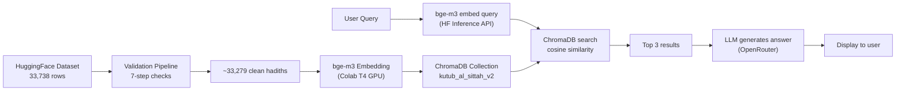

# Kutub al-Sittah Hadith RAG Chatbot

A high-performance, intelligent Retrieval-Augmented Generation (RAG) Chatbot for the six canonical Hadith collections (Kutub al-Sittah) in English.

The pipeline downloads a clean, pre-structured dataset from HuggingFace (sourced from [sunnah.com](https://sunnah.com)), runs a 7-step validation filter, embeds all hadiths using `BAAI/bge-m3` on a Google Colab T4 GPU, and stores them in a ChromaDB vector database. When queried, it uses the OpenRouter API to generate natural, synthesised, plain-English answers strictly grounded in retrieved hadiths, complete with pristine online digital citations and automated zero-leakage safety filters.

---

## Architecture Overview

The system operates in two core pipelines: **Data Preprocessing & Ingestion** (one-time database population) and **Runtime** (user query, retrieval, safety filtering, LLM generation, and digital text viewing).



### Detailed Runtime Flow

```mermaid
flowchart TD
    subgraph Runtime ["Search, Safety Guardrails & Generation Pipeline"]
        User["User Question"] --> EmbedQuery["retriever.py<br/>(BGE-M3 via HF Inference API)"]
        EmbedQuery --> SearchDB["ChromaDB Cosine Search<br/>(Retrieve Top-K=3 Hadiths)"]
        SearchDB --> Shield1["chat.py: Layer 1 Shield<br/>(Cosine Distance > 0.42?)"]
        
        Shield1 -->|Yes - Irrelevant| Refuse["Refusal Response<br/>'I could not find any relevant data...'"]
        Shield1 -->|No - Valid Match| Generator["generator.py<br/>(OpenRouter / Gemini 2.5 Flash)"]
        
        Generator --> Shield2["chat.py: Layer 2 Sentinel<br/>(Check REFUSAL_SHIELD token)"]
        Shield2 -->|Triggered| Refuse
        Shield2 -->|Clean Answer| Display["Interactive CLI Panel<br/>(Rich Markdown Formatting)"]
        
        Display --> ViewCmd["/view Command"]
        ViewCmd --> APIFetch["api_fetcher.py<br/>(Dynamic Dual-API Cascade)"]
        APIFetch --> CleanText["Display Clean, Pristine Text<br/>(Digital Online or Local Failsafe)"]
    end
```



---

## Corpus & Database Statistics

The preprocessing pipeline validated **33,738 rows** from the HuggingFace dataset, with a **98.2% pass rate**, indexing a total of **33,279 clean hadiths**.

| Book | Documents | Percentage |
|:---|:---:|:---:|
| **Sahih Muslim** | 7,335 | 22.0% |
| **Sahih al-Bukhari** | 7,241 | 21.8% |
| **Sunan an-Nasai** | 5,677 | 17.1% |
| **Sunan Abu Dawud** | 4,997 | 15.0% |
| **Sunan Ibn Majah** | 4,059 | 12.2% |
| **Jami at-Tirmidhi** | 3,970 | 11.9% |
| **TOTAL** | **33,279** | **100%** |

---

## Technical Highlights

### 1. Clean Data Source & 7-Step Validation

Instead of OCR-based PDF extraction, the pipeline uses `meeAtif/hadith_datasets` from HuggingFace — a clean dataset scraped directly from [sunnah.com](https://sunnah.com). Every hadith passes through a rigorous 7-step validation:

1. **Non-empty** English text
2. **Length >= 50 chars** (filters stubs)
3. **No duplicate** reference URLs
4. **Garble ratio <= 1%** (backtick excluded for transliteration)
5. **Narrator chain present** (for texts >100 chars)
6. **Not commentary-dominated** (>70% bracketed text)
7. **Not Arabic-dominated** in the English field

### 2. Dual-Layer Zero-Leakage Safety Guardrails

To prevent hallucination, out-of-scope answers, and resource depletion from non-Islamic queries:

*   **Layer 1 (Retriever Distance Shield):** Before calling the LLM, the system measures the cosine distance of the closest match. If `distance > 0.42`, the query is flagged as out-of-scope, and the app immediately serves a polite refusal — saving API tokens.
*   **Layer 2 (LLM Sentinel Guard):** If a query slips past the distance filter but remains irrelevant, the LLM is instructed to output `[REFUSAL_SHIELD]`. The CLI catches this token and presents a clean refusal.

### 3. Dynamic Hybrid `/view` Fetcher (`retrieval/api_fetcher.py`)

When a user types `/view <number>`, the system fetches clean, proofread digital text:
1.  **Primary API:** Fawazahmed's digital Hadith CDN (fast, jsDelivr CDN).
2.  **Fallback API:** `hadithapi.pages.dev` (excellent for Sahih Muslim coverage).
3.  **Local Failsafe:** Database text if both APIs are unavailable.

### 4. GPU-Accelerated Embedding on Colab

Embedding 33,279 hadiths runs on a Google Colab T4 GPU in ~10 minutes using memory-safe chunked processing with explicit garbage collection between batches.

---

## Project Structure

```
Ahadees (RAG) Project/
├── chat.py                  # Main CLI application (entry point)
├── retrieval/
│   ├── retriever.py         # Query embedding (HF API) + ChromaDB search
│   ├── generator.py         # LLM answer generation (OpenRouter)
│   └── api_fetcher.py       # Clean text fetcher for /view command
├── scripts/
│   ├── colab_reingest.py    # Full re-ingestion pipeline (Google Colab)
│   └── test_v2_db.py        # Comprehensive DB verification (8-test suite)
├── chroma_db_v2/            # ChromaDB database (33,279 hadiths, ~276 MB)
├── .env                     # API keys & configuration
├── requirements.txt         # Python dependencies
├── MASTER_PLAN.md           # Internal implementation plan
└── README.md                # This file
```

---

## How to Install and Run

### 1. Clone and Install Dependencies

Ensure you have Python 3.10+ installed:
```bash
git clone https://github.com/alifsayalee/Kutub-al-Sittah-Hadith-RAG-Chatbot-Open.git
cd Kutub-al-Sittah-Hadith-RAG-Chatbot-Open
pip install -r requirements.txt
```

### 2. Environment Setup

Create a `.env` file in the root directory:
```env
HF_API_TOKEN=your_huggingface_token
OPEN_ROUTER_API_KEY=your_openrouter_api_key
CHROMA_DB_PATH=./chroma_db_v2
CHROMA_COLLECTION_NAME=kutub_al_sittah_v2
TOP_K=3
HF_HUB_DISABLE_TELEMETRY=1
```

- **HF_API_TOKEN:** Free from [huggingface.co/settings/tokens](https://huggingface.co/settings/tokens) — used for query embedding.
- **OPEN_ROUTER_API_KEY:** From [openrouter.ai](https://openrouter.ai) — used for LLM answer generation.

### 3. Populating the Vector Database

The database is pre-built and included in the repository. If you need to rebuild it from scratch:

1. Open `scripts/colab_reingest.py`
2. Copy each cell into a Google Colab notebook (Runtime → T4 GPU)
3. Run all cells — downloads dataset, validates, embeds, builds ChromaDB
4. Download the generated `chroma_db_v2.zip`
5. Unzip into the project root

### 4. Run the CLI Application

```bash
python chat.py
```

### 5. Verify the Database (optional)

```bash
python scripts/test_v2_db.py
```

---

## Interactive CLI Features

The `chat.py` interface is built using `rich` for a premium terminal experience:

*   **Book Filtering:** Search all 6 collections (Option `0`) or target a specific book (Options `1-6`).
*   **Interactive Commands:**
    *   `/filter` — Switch the targeted collection mid-session.
    *   `/view <number>` — Fetch and display clean digital text for any referenced source.
    *   `/clear` — Clear the terminal screen.
    *   `exit` or `quit` — Gracefully close the application.
*   **Color-Coded UI:** Status spinners, green panels for answers, blue panels for pristine texts, red alerts for safety shields.

---

## Example Output

```text
Question: What is said about nikkah in islam? when is it recommended?

============================================================
 Synthesized Answer
Nikah, in Islamic tradition, is understood as a sacred bond of marriage,
signifying a union between individuals. Linguistically, it means to unite
and bring together, metaphorically representing the profound connection
established through matrimony...

The Prophet Muhammad (peace be upon him) exemplified Nikah as his Sunnah,
a practice also observed by previous prophets. It is considered a compulsory
duty for those who are physically healthy, can afford the expenses of
marriage and a wife's living costs...

 Referenced Hadith Sources:
 [1] Sunan Ibn Majah, Vol 3, Hadith 1844
 [2] Sunan Abu Dawud, Vol 5, Hadith 5274
 [3] Sunan Ibn Majah, Vol 4, Hadith 2918

To read the full clean text of any reference, type '/view <number>'.
============================================================
```

---

## Data Source & License

- **Dataset:** [`meeAtif/hadith_datasets`](https://huggingface.co/datasets/meeAtif/hadith_datasets) on HuggingFace
- **Original Source:** [sunnah.com](https://sunnah.com)
- **Dataset License:** MIT
- **Embedding Model:** [BAAI/bge-m3](https://huggingface.co/BAAI/bge-m3) (Apache 2.0)
