# Kutub al-Sittah Hadith RAG Chatbot

A high-performance, intelligent Retrieval-Augmented Generation (RAG) system for the six canonical Hadith collections (Kutub al-Sittah) in English. 

The pipeline ingests raw PDFs, intelligently chunks text into individual hadiths (filtering out commentary, page numbers, and editorial noise), embeds them using a local `BAAI/bge-m3` model, and stores them in a ChromaDB vector database. When queried, it uses the OpenRouter API to generate natural, synthesised, plain-English answers strictly grounded in retrieved hadiths, complete with pristine online digital citations and automated zero-leakage safety filters.

---

## 🕌 Architecture Overview

The system operates in two core pipelines: **Ingestion** (one-time database population) and **Runtime** (user query, retrieval, safety filtering, LLM generation, and digital text viewing).

```mermaid
flowchart TD
    subgraph Ingestion ["1. Data Ingestion & Indexing Pipeline (One-Time)"]
        PDF["37 PDF Volumes<br/>(Kutub al-Sittah)"] --> Loader["loader.py<br/>(PyMuPDF Text Extractor)"]
        Loader --> Chunker["chunker.py<br/>(State-Machine Chunker)"]
        Chunker --> Embedder["embedder.py<br/>(Local BAAI/bge-m3 Model)"]
        Embedder --> Chroma["ChromaDB Local Vector Store<br/>(31,414 Hadith Vectors)"]
    end

    subgraph Runtime ["2. Search, Safety Guardrails & Generation Pipeline (Runtime)"]
        User["User Question"] --> EmbedQuery["retriever.py<br/>(BGE-M3 Query Vector)"]
        EmbedQuery --> SearchDB["ChromaDB Cosine Search<br/>(Retrieve Top-K=5 Hadiths)"]
        SearchDB --> Shield1["chat.py: Layer 1 Shield<br/>(Cosine Distance Threshold > 0.45?)"]
        
        Shield1 -->|Yes - Irrelevant/Gibberish| Refuse["Refusal Response<br/>'I could not find any relevant data...'"]
        Shield1 -->|No - Valid Match| Generator["generator.py<br/>(OpenRouter / Gemini 2.5 Flash)"]
        
        Generator --> Shield2["chat.py: Layer 2 Sentinel<br/>(Verify [REFUSAL_SHIELD] presence)"]
        Shield2 -->|Triggered| Refuse
        Shield2 -->|Clean Answer| Display["Interactive CLI Panel<br/>(Rich Markdown Formatting)"]
        
        Display --> ViewCmd["/view Command"]
        ViewCmd --> APIFetch["api_fetcher.py<br/>(Dynamic Dual-API Cascade)"]
        APIFetch --> CleanText["Display Clean, Pristine Text<br/>(Digital Online or Local Failsafe)"]
    end
```



---

## 📊 Corpus & Database Statistics

The ingestion pipeline successfully processed **37 volumes** across the 6 canonical collections, indexing a total of **31,414 valid hadiths** with an overall coverage rate of **~91%** of the official corpuses.

| Book | Volumes | Total Chunks | Last Hadith ID | Coverage Notes |
|:---|:---:|:---:|:---:|:---|
| **Sahih al-Bukhari** | 9 | 7,104 | #7563 | ~94% coverage |
| **Sahih Muslim** | 7 | 6,727 | #7563 | ~89% coverage (Muslim regex fix included) |
| **Sunan Abu Dawud** | 5 | 5,054 | #5274 | ~96% coverage |
| **Jami` at-Tirmidhi** | 6 | 3,541 | #3956 | ~90% coverage |
| **Sunan an-Nasai** | 5 | 4,876 | #4987 | ~85% coverage (only 5 of 7 vols in English) |
| **Sunan Ibn Majah** | 5 | 4,112 | #4341 | ~95% coverage |
| **TOTAL** | **37** | **31,414** | — | **~91% Average Coverage** |

---

## ⚡ Technical Highlights

### 1. Robust State-Machine Chunking (`ingestion/chunker.py`)
PDF text extraction is plagued by OCR errors, translator commentary, footnote listings, and headers. Our custom two-pass chunker:
*   Uses per-book regex patterns to detect boundary splits (e.g., `^\[\d+\]` vs `^\d+\.`).
*   Implements a state machine with sequential tracking to distinguish real hadiths from commentary bullet points.
*   Performs narration keyword heuristic checks (`"narrated"`, `"reported"`, etc.) in the first 200 characters of each candidate.
*   Applies a self-healing `RESET_THRESHOLD` to recover tracking if a long translator preface contains a numbered list.

### 2. Dual-Layer Zero-Leakage Safety Guardrails
To prevent hallucination, out-of-scope answers, and resource depletion from non-Islamic queries (e.g., code snippets, phone numbers, gibberish), we developed a two-tier safety filter:
*   **Layer 1 (Retriever Distance Shield):** Before calling the LLM, the system measures the cosine distance of the closest match in ChromaDB. If `distance > 0.45`, the query is flagged as completely out-of-scope, and the app immediately serves a polite refusal, saving your API token quota.
*   **Layer 2 (LLM Sentinel Guard):** If a query slips past the distance filter but remains irrelevant, the LLM is instructed in its system prompt to output exactly `[REFUSAL_SHIELD]`. The CLI catches this token and presents a clean, safe refusal.

### 3. Dynamic Hybrid `/view` Fetcher (`retrieval/api_fetcher.py`)
To offer a premium, distraction-free reading experience, when a user types `/view <number>`, the system bypasses noisy OCR artifacts in the PDF and fetches clean, proofread digital text:
1.  **Primary API:** Attempts to fetch from Fawazahmed's digital Hadith CDN (fast, highly reliable jsDelivr CDN).
2.  **Fallback API:** If empty or rate-limited, it automatically falls back to `hadithapi.pages.dev` (excellent for full Sahih Muslim coverage).
3.  **Local Failsafe:** If offline, it uses our local database text run through a regex-based string sanitizer to remove garbled Arabic characters and OCR noise.

---

## 🚀 How to Install and Run

### 1. Clone and Install Dependencies
Ensure you have Python 3.10+ installed. Install the dependencies:
```bash
pip install -r requirements.txt
```

### 2. Environment Setup
Create a `.env` file in the root directory and add your API keys:
```env
OPEN_ROUTER_API_KEY=your_openrouter_api_key
HF_API_TOKEN=your_huggingface_token
CHROMA_DB_PATH=./chroma_db
CHROMA_COLLECTION_NAME=kutub_al_sittah
TOP_K=5
HF_HUB_DISABLE_TELEMETRY=1
```

### 3. Populating the Vector Database
Place your raw PDF volumes in the `data/` folder sorted by book key (e.g., `data/bukhari/vol1.pdf`). Run the idempotent ingestion script:
```bash
python -m ingestion.ingest
```
*Note: The first run will download the ~2.2GB BAAI/bge-m3 model locally. The ingest process uses an idempotency log (`ingested_files.json`) so you can interrupt the process and safely resume it without duplicating entries.*

### 4. Run the Beautiful CLI Application
Launch the rich, interactive terminal console:
```bash
python chat.py
```

---

## 💬 Interactive CLI Features

The `chat.py` interface is built using `rich` for a visually stunning terminal experience:
*   **Book Filtering:** Choose to search the entire Kutub al-Sittah (Option `0`) or target a specific book (Options `1-6`).
*   **Interactive Commands:**
    *   `/filter` — Switch the targeted collection or book mid-session.
    *   `/view <number>` — Fetch and display the clean digital text for any referenced source.
    *   `/clear` — Clear the terminal screen and reset the view.
    *   `exit` or `quit` — Gracefully close the application.
*   **Color-Coded Statuses:** Beautiful status spinners, green panels for answers, blue panels for pristine digital texts, and red alerts for safety shields.

---

## 📝 Example Output

```text
Question: What is said about nikkah in islam? when is it recommended?

============================================================
🕌 Synthesized Answer
Nikah, in Islamic tradition, is understood as a sacred bond of marriage, signifying a union between individuals. Linguistically, it means to unite and bring together, metaphorically representing the profound connection established through matrimony. This bond is formalized through specific words like "Nikah" or "Tazwij," making the relationship lawful and bringing immense blessings...

The Prophet Muhammad (peace be upon him) exemplified Nikah as his Sunnah, a practice also observed by previous prophets. It is considered a compulsory duty for those who are physically healthy, can afford the expenses of marriage and a wife's living costs, and face the risk of engaging in illicit desires that cannot be overcome by fasting alone...

📖 Referenced Hadith Sources:
 [1] Sunan Ibn Majah, Vol 3, Hadith 1844
 [2] Sunan Abu Dawud, Vol 5, Hadith 5274
 [3] Sunan Ibn Majah, Vol 4, Hadith 2918

To read the full clean text of any reference, type '/view <number>' (e.g., '/view 1').
============================================================
```
